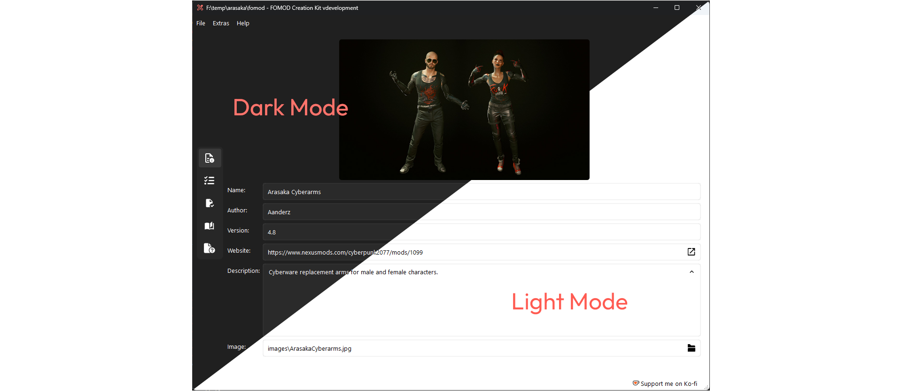
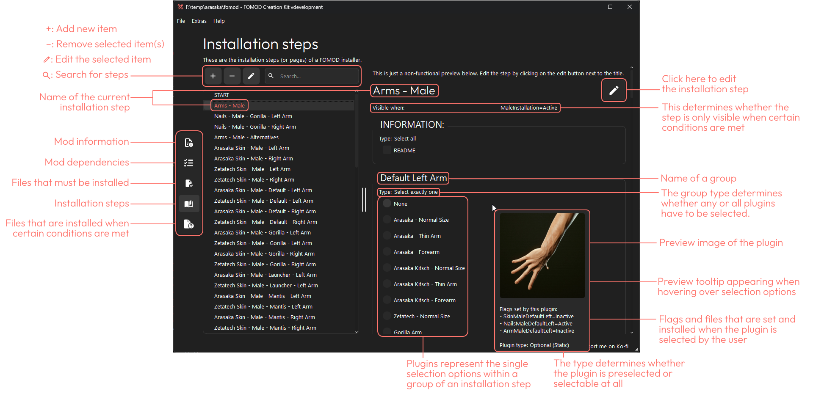
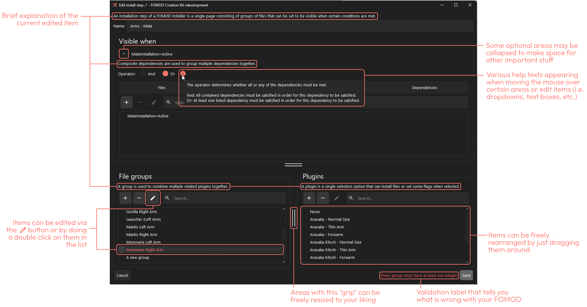

<p align="center">
  <picture>
    
  </picture>
  <br>
  
  <br>
  <br>
  <a href="https://discord.gg/pqEHdWDf8z"> </a>
  <a href="https://www.nexusmods.com/site/mods/1366"> </a>
  <a href="https://ko-fi.com/cutleast"> </a>
  <br>
</p>

# Description

An intuitive yet advanced tool for editing and creating FOMOD installers. The entire tool is designed to be self-explanatory with small info texts placed everywhere
making the creation and editing of FOMOD installers accessible for beginners that are looking for a nice way to package their mods.
Advanced users already familiar with the FOMOD specification will find that this tool supports every single feature the specification has to offer.

# ❗Disclaimer

This project is still under development! Despite being thoroughly tested both manually and automatically, there might still be some bugs and errors left.
Please report any bugs or suggestions you encounter either in the "Issues" tab of this repository or on our [Discord server](https://discord.gg/pqEHdWDf8z).
Contributions are always welcome, too, see instructions below.

# Features

### Automated file and folder management

- Enables you to select files from all over your computer and add them to the FOMOD.
- When the FOMOD is saved, all those files get automatically copied to the FOMOD's location and the paths are made relative so that the entire package is ready to be packed and distributed.
- Manual file and folder management is still possible as this only affects files that are outside of the FOMOD's parent folder.
- Enabled by default but can be disabled in *File* > *Settings* > *Finalize on save (recommended)*.

<details>
  <summary><b>A finalized FOMOD could look like this:</b></summary>

```
  fomod/
  ├─ ModuleConfig.xml
  ├─ info.xml
  ├─ ModuleImage/
  │  └─ example.png
  ├─ images/
  │  └─ Example Install Step/
  │     └─ Example Group/
  │        └─ Example Plugin/
  │           └─ example.jpg
  └─ files/
      ├─ install_steps/
      │  └─ Example Install Step/
      │     └─ Example Group/
      │        └─ Example Plugin/
      │           └─ example.esl
      ├─ required_install_files/
      │   ├─ interface/
      │   │  └─ translations/
      │   │     └─ example_english.txt
      │   └─ example.esp
      ├─ conditional_install_files.0/
      │   └─ example_patch.esp
      └─ conditional_install_files.1/
          └─ interface/
              └─ translations/
                  └─ example_german.txt
```

</details>

### Optional automatic validation against the FOMOD XML schema

- Disabled by default but can be enabled in *File* > *Settings* > *Validate XML files on save*.

### Modern and native UI based on Qt 6

You can now create and edit FOMODs without burning your eyes ;)

#### Screenshots

<p align="center">
  <picture>
    
  </picture>
  <br>
  <br>
  <picture>
    
  </picture>
  <br>
  <br>
  <picture>
    
  </picture>
</p>

**As always, feedback and suggestions for improving the UI or QoL are very appreciated!**

# 🫶Contributing

## Feedback (Suggestions/Issues)

If you encountered an issue/error or have a suggestion, open an issue with sufficient information.

## Code contributions

### 1. Install requirements

1. Install [Python 3.12](https://www.python.org/downloads/) (Make sure that you add it to PATH!)
2. Install [uv](https://github.com/astral-sh/uv#installation)
3. Clone repository
4. Open a terminal in the cloned repository folder
5. Run the following command to init your local environment and to install all dependencies
   `uv sync`

### 2. Execute from source

1. Open a terminal in the root folder of this repo
2. Execute main file with uv
   `uv run src\main.py`

### 3. Compile and build executable

1. Run `build.bat` from the root folder of this repo.
2. The executable and all dependencies are built in the `dist/FCK`-Folder and get packed in a `dist/FOMOD Creation Kit v[version].zip`.

### 4. Optional: Build Inno Setup installer

1. Install [Inno Setup](https://jrsoftware.org/download.php/is.exe) and add its installation folder to PATH
2. Run the `build_iss.bat` from the root folder of this repo.
3. The installer executable gets outputted in `dist/FOMOD-Creation-Kit_v[version]_installer.exe`.

## Translations

Make sure to follow the steps under [Code contributions](#code-contributions) above to install all requirements, including the Qt tools to translate this app.

1. To generate a translation file for a new language, copy the following line in [update_lupdate_file.bat](./update_lupdate_file.bat):
`--add-translation=res/loc/de.ts ^`, insert it directly beneath it and change the `de` value to the short code of your language.
For example, to generate a file for French, the new line would look like this: `--add-translation=res/loc/fr.ts ^`
2. Run `update_lupdate_file.bat && update_qts.bat` to generate the translation file for your language.
3. Open the translation file in Qt Linguist with `uv run pyside6-linguist res/loc/<language>.ts`, eg. `uv run pyside6-linguist res/loc/fr.ts`.
4. Translate the app and save the file with Ctrl+S.
5. For your language to show up in FCK's settings: add a line, similar to the existing languages, under `class Language(BaseEnum):` in [localisation.py](./src/core/utilities/localisation.py). For example, for French: `French = "fr_FR"`.
6. Optional: Run `compile_qts.bat && uv run src\main.py` and change the language in *Settings* to your translation (and restart) to see your translation in action.
7. Create a pull request from your changes and I will check over it and merge it if there are no issues with it.

# 🔗Credits

- Code by Cutleast ([GitHub](https://github.com/Cutleast) | [NexusMods](https://next.nexusmods.com/profile/Cutleast))
- Qt by The [Qt Company Ltd](https://qt.io)
- FontAwesome Icons by [FontAwesome](https://github.com/FortAwesome/Font-Awesome)
- [fomod 5.x Documentation by Daniel Nunes and the fomod team](https://fomod-docs.readthedocs.io/en/latest/index.html)

See [licenses.py](./src/core/utilities/licenses.py) for a full list of used libraries, dependencies and their respective licenses.
